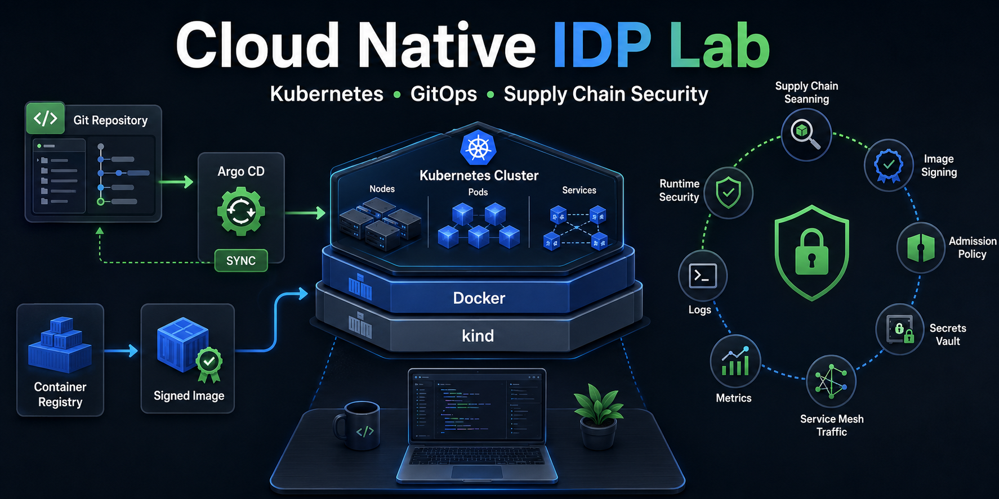

# Cloud Native Internal Developer Platform Lab



This repository turns the CNCF blog post [Building a Cloud Native Internal Developer Platform with Kubernetes, GitOps and Supply Chain Security](https://www.cncf.io/blog/2026/05/29/building-a-cloud-native-internal-developer-platform-with-kubernetes-gitops-and-supply-chain-security/) into a local, hands-on lab.

You will build a complete internal developer platform on a kind Kubernetes cluster using Docker, Gitea, Argo CD, Helm, Istio, Kyverno, Cosign, Trivy, KubeSec, Prometheus, Grafana, Loki, Promtail, Falco, Vault, and Secrets Store CSI.

The lab is local-only. It uses an in-cluster Gitea repository instead of GitHub and a generated local Cosign keypair instead of cloud OIDC so every learner can reproduce the same setup.

## What You Will Learn

By the end of the lab, you should understand how these platform pieces fit together:

- Kubernetes as the platform foundation.
- GitOps with Argo CD as the deployment control plane.
- Secure application delivery with tests, scans, image signing, and verification.
- Policy enforcement with Kyverno.
- Service-to-service traffic management with Istio and mTLS.
- Observability with metrics, dashboards, logs, and runtime alerts.
- Secret delivery from Vault through Secrets Store CSI.
- GitOps rollback and drift correction.

## What You Will Build

| Blog topic | Local lab implementation |
| --- | --- |
| Kubernetes platform foundation | kind cluster with Calico CNI and NetworkPolicy |
| GitOps control plane | Argo CD syncing from in-cluster Gitea |
| App delivery | Two Python services packaged as containers and Helm charts |
| CI/CD security gates | Unit tests, Bandit, Trivy, KubeSec, Cosign sign/verify |
| Admission control | Kyverno policies for image tags, pod security, and signature audit |
| Service mesh | Istio gateway, VirtualServices, PeerAuthentication, and mTLS demo |
| Observability | Prometheus, Grafana, Loki, and Promtail |
| Runtime security | Falco plus RuntimeDefault seccomp demo |
| Secret management | Vault dev server mounted through Secrets Store CSI |
| Rollback and drift | Argo CD self-heal and Git rollback workflow |

## Prerequisites

### Host Requirements

Use a Linux x86_64 machine or WSL2 on x86_64. The tool installer downloads Linux AMD64 binaries.

Recommended capacity:

- 4 CPU cores.
- 8 GB RAM minimum.
- 15 GB free disk.
- Internet access for the first run.
- Docker running and accessible by your current user.

This lab creates a local kind cluster and does not use a production Kubernetes context.

### Required Host Commands

Install these before starting:

```sh
docker --version
git --version
make --version
python3 --version
curl --version
tar --version
timeout --version
base64 --version
```

On Ubuntu or WSL2, the non-Docker packages are usually installed with:

```sh
sudo apt-get update
sudo apt-get install -y git make curl tar python3 python3-venv coreutils
```

Verify Docker access:

```sh
docker ps
docker version --format '{{.Server.Version}}'
```

If either command fails, start Docker or fix Docker user permissions before continuing.

### Tools You Do Not Need To Preinstall

The lab installs pinned repo-local CLIs into `./bin`:

- kind
- kubectl
- helm
- argocd
- cosign
- trivy
- kubesec

It also creates a Python virtual environment at `.lab/venv` and installs Bandit there.

### Ports Used

Make sure these local ports are available:

| Port | Used by |
| --- | --- |
| `5001` | Local Docker registry |
| `8080` | Istio ingress gateway HTTP traffic |
| `8443` | Istio ingress gateway HTTPS mapping |
| `13000` | Temporary Gitea port-forward during deploy |
| `8081` | Optional Argo CD UI port-forward |
| `3000` | Optional Grafana UI port-forward |

If `13000` is busy, run deploy with a different temporary port:

```sh
GITEA_LOCAL_PORT=13001 make deploy
```

The registry and gateway ports are defined in `versions.env` and `infra/kind/cluster.yaml`. If you change them, recreate the lab with `make down` and `make up`.

## Repository Layout

```text
apps/
  catalog-api/        Python API, tests, Dockerfile, and Helm chart
  orders-api/         Python API, tests, Dockerfile, and Helm chart
demos/                Hands-on policy, mTLS, Falco, seccomp, and network demos
gitops/
  argocd/             Argo CD Application definitions
  apps/               App networking and namespace resources
  bootstrap/          App-of-apps grouping
  platform/           Policies, Vault config, and platform resources
infra/
  kind/               Declarative kind cluster config
  terraform/          Local IaC reference for kind
platform/bootstrap/   Bootstrap manifests for Gitea and Argo CD
scripts/              Repeatable setup, pipeline, deploy, verify, and cleanup scripts
versions.env          Pinned lab versions
```

Generated files are written to `.lab/`, `bin/`, `dist/`, and `reports/`. These are intentionally ignored by Git.

## Lab Flow

Run every command from the repository root.

If you cloned from GitHub:

```sh
git clone git@github.com:waiyanwh/cn-idp-lab.git
cd cn-idp-lab
```

If you are already in the repository, start with:

```sh
make help
```

Expected output lists the main lab targets: `tools`, `up`, `pipeline`, `deploy`, `verify`, `demos`, `render`, `lint`, and `down`.

## Step 1: Install Repo-Local Tools

```sh
make tools
```

This step downloads pinned tools from `versions.env` into `./bin` and installs Bandit into `.lab/venv`.

Success check:

```sh
./bin/kind version
./bin/kubectl version --client=true
./bin/helm version --short
./bin/cosign version
./bin/trivy --version
./bin/kubesec version
```

If `make tools` fails with `this lab installer currently supports Linux only`, run the lab from Linux or WSL2.

## Step 2: Create The Local Platform Foundation

```sh
make up
```

This step creates the platform foundation:

1. Starts a local registry at `127.0.0.1:5001`.
2. Creates a kind cluster named `cncf-idp`.
3. Configures containerd so Kubernetes can pull from the local registry.
4. Installs Calico because the lab uses NetworkPolicy.
5. Deploys in-cluster Gitea.
6. Creates the Gitea admin user.
7. Installs Argo CD.

Success checks:

```sh
./bin/kind get clusters
./bin/kubectl --context kind-cncf-idp get nodes -o wide
./bin/kubectl --context kind-cncf-idp get pods -A
```

You should see a two-node kind cluster and pods in namespaces such as `kube-system`, `calico-system`, `gitea`, and `argocd`.

## Step 3: Run The Supply Chain Pipeline

```sh
make pipeline
```

This step simulates the secure CI part of the platform:

1. Runs Python unit tests for `catalog-api` and `orders-api`.
2. Runs Bandit SAST against application source code.
3. Runs Trivy filesystem scans.
4. Builds Docker images.
5. Runs Trivy image scans.
6. Pushes images to `localhost:5001`.
7. Generates a local Cosign keypair in `.lab/cosign/`.
8. Signs and verifies host image references.
9. Signs and verifies in-cluster image references for Kyverno verification.
10. Renders Helm manifests.
11. Runs KubeSec against rendered app manifests.

Success checks:

```sh
ls reports
docker images | grep 'localhost:5001/idp'
curl -fsS http://127.0.0.1:5001/v2/_catalog
```

Useful reports:

```text
reports/bandit.json
reports/trivy-fs.txt
reports/trivy-catalog-api.txt
reports/trivy-orders-api.txt
reports/cosign-catalog-api.json
reports/cosign-orders-api.json
reports/kubesec-apps.json
```

The scan commands are configured for learning. They write findings to reports instead of stopping the lab on every finding.

## Step 4: Deploy With GitOps

```sh
make deploy
```

This step turns the local repository into a GitOps source:

1. Opens a temporary port-forward to Gitea.
2. Creates or updates the `platform/idp-gitops` repository in Gitea.
3. Copies GitOps content and app Helm charts into the Gitea repo.
4. Pushes the GitOps repo.
5. Applies the Argo CD root application.
6. Lets Argo CD install platform components and apps.
7. Configures Vault Kubernetes auth.
8. Writes sample secrets for both apps into Vault.

Success checks:

```sh
./bin/kubectl --context kind-cncf-idp -n argocd get applications
./bin/kubectl --context kind-cncf-idp -n apps get deployments,pods
```

All Argo CD applications should eventually show `Synced`. Most should also show `Healthy`.

Useful watch command:

```sh
./bin/kubectl --context kind-cncf-idp -n argocd get applications -w
```

Stop watching with `Ctrl+C`.

## Step 5: Verify The Running Platform

```sh
make verify
```

This step checks the important lab outcomes:

- Core deployments are available.
- Argo CD applications are synced.
- App traffic works through the Istio gateway.
- Vault-provided secrets are visible to the apps.
- Kyverno rejects a mutable `latest` image tag.
- NetworkPolicy blocks unauthorized client traffic.
- Cosign verification reports exist.

Manual API checks:

```sh
curl -s http://localhost:8080/catalog | python3 -m json.tool
curl -s http://localhost:8080/orders | python3 -m json.tool
```

Both responses should include a `secret_message` value loaded from Vault through Secrets Store CSI.

## Step 6: Open Dashboards

### Gitea

Run this in a separate terminal:

```sh
./bin/kubectl --context kind-cncf-idp -n gitea port-forward svc/gitea-http 13000:3000
```

Open:

```text
http://localhost:13000
```

Login:

```text
username: platform
password: platform-password
```

The GitOps repository is `platform/idp-gitops`. This is the local source Argo CD syncs from.

### Argo CD

Run this in a separate terminal:

```sh
./bin/kubectl --context kind-cncf-idp -n argocd port-forward svc/argocd-server 8081:80
```

Open:

```text
http://localhost:8081
```

Username:

```text
admin
```

Get the initial password:

```sh
./bin/kubectl --context kind-cncf-idp -n argocd get secret argocd-initial-admin-secret \
  -o jsonpath='{.data.password}' | base64 -d; echo
```

Use Argo CD to inspect application sync status, health, resources, and drift.

### Grafana

Run this in a separate terminal:

```sh
./bin/kubectl --context kind-cncf-idp -n observability port-forward svc/kube-prometheus-stack-grafana 3000:80
```

Open:

```text
http://localhost:3000
```

Username:

```text
admin
```

Get the password:

```sh
./bin/kubectl --context kind-cncf-idp -n observability get secret kube-prometheus-stack-grafana \
  -o jsonpath='{.data.admin-password}' | base64 -d; echo
```

Use Grafana to explore Kubernetes metrics. Loki and Promtail are also deployed so the lab includes a local log collection path.

## Step 7: Run Learning Demos

Run the safe demo suite:

```sh
make demos
```

This validates selected controls and prints the larger demo map.

### Demo: Kyverno Blocks Mutable Image Tags

```sh
./bin/kubectl --context kind-cncf-idp apply --dry-run=server -f demos/kyverno-latest-blocked.yaml
```

Expected result: the request is rejected because the demo pod uses an image tag that ends in `latest`.

### Demo: NetworkPolicy Blocks Unauthorized Traffic

```sh
./bin/kubectl --context kind-cncf-idp apply -f demos/network-denied.yaml
./bin/kubectl --context kind-cncf-idp -n blocked-client wait \
  --for=jsonpath='{.status.phase}'=Succeeded pod/blocked-client --timeout=60s
./bin/kubectl --context kind-cncf-idp -n blocked-client logs pod/blocked-client
./bin/kubectl --context kind-cncf-idp delete -f demos/network-denied.yaml --wait=false
```

Expected result: logs show the connection was blocked. This proves Calico NetworkPolicy is enforcing namespace isolation.

### Demo: RuntimeDefault Seccomp

```sh
./bin/kubectl --context kind-cncf-idp apply -f demos/seccomp-runtime-default.yaml
./bin/kubectl --context kind-cncf-idp -n apps get pod seccomp-runtime-default \
  -o jsonpath='{.spec.securityContext.seccompProfile.type}{"\n"}'
./bin/kubectl --context kind-cncf-idp delete -f demos/seccomp-runtime-default.yaml --wait=false
```

Expected result:

```text
RuntimeDefault
```

### Demo: Falco Runtime Alert

```sh
./bin/kubectl --context kind-cncf-idp apply -f demos/falco-trigger.yaml
sleep 15
./bin/kubectl --context kind-cncf-idp -n falco logs ds/falco --tail=30
./bin/kubectl --context kind-cncf-idp delete -f demos/falco-trigger.yaml --wait=false
```

Expected result: Falco logs show runtime activity from the demo pod.

### Demo: Istio Strict mTLS

Apply strict mTLS:

```sh
./bin/kubectl --context kind-cncf-idp apply -f demos/strict-mtls.yaml
curl -s http://localhost:8080/catalog | python3 -m json.tool
```

Restore the lab's normal mTLS policy:

```sh
./bin/kubectl --context kind-cncf-idp apply -f gitops/apps/networking/peer-authentication.yaml
```

Expected result: app traffic through the gateway still works, while service-to-service traffic is governed by Istio policy.

### Demo: Argo CD Self-Heals Drift

Change live state manually:

```sh
./bin/kubectl --context kind-cncf-idp -n apps scale deploy/catalog-api --replicas=0
```

Watch Argo CD restore the declared state:

```sh
./bin/kubectl --context kind-cncf-idp -n apps get deploy/catalog-api -w
```

Stop watching after replicas return with `Ctrl+C`.

This demonstrates why Git, not manual `kubectl` edits, is the deployment source of truth.

### Demo: GitOps Rollback

1. Edit `apps/catalog-api/chart/values.yaml`.
2. Change `replicaCount` from `2` to `1`.
3. Run:

   ```sh
   make deploy
   ```

4. Watch Argo CD reconcile:

   ```sh
   ./bin/kubectl --context kind-cncf-idp -n argocd get app catalog-api -w
   ```

5. Revert the file locally.
6. Run:

   ```sh
   make deploy
   ```

7. Confirm the deployment returns to the original replica count:

   ```sh
   ./bin/kubectl --context kind-cncf-idp -n apps get deploy/catalog-api
   ```

## Validation Commands

Use these commands while developing or changing the lab:

```sh
make lint
make render
make pipeline
make verify
make demos
```

What they do:

| Command | Purpose |
| --- | --- |
| `make lint` | Shell syntax checks, optional ShellCheck, Helm lint, Terraform validate when installed, and render checks |
| `make render` | Render app Helm charts into `dist/rendered/` |
| `make pipeline` | Test, scan, build, push, sign, verify, render, and KubeSec scan |
| `make verify` | Check deployed platform, app traffic, policy denial, NetworkPolicy, and Cosign reports |
| `make demos` | Run safe demo checks after the platform is deployed |

For a clean end-to-end run:

```sh
make down
make tools
make up
make pipeline
make deploy
make verify
make demos
```

## Troubleshooting

### Docker Is Not Responding

Error example:

```text
Docker daemon is not responding
```

Fix:

```sh
docker ps
docker version --format '{{.Server.Version}}'
```

Start Docker Desktop, restart the Docker service, or fix your user permissions, then rerun the failed make target.

### A Port Is Already In Use

Check listening ports:

```sh
ss -ltnp | grep -E ':5001|:8080|:8443|:13000|:8081|:3000'
```

For the temporary Gitea port-forward only:

```sh
GITEA_LOCAL_PORT=13001 make deploy
```

For registry or gateway port conflicts, stop the conflicting process or update `versions.env` and `infra/kind/cluster.yaml`, then recreate the lab:

```sh
make down
make up
```

### Argo CD Application Is Not Healthy

List applications:

```sh
./bin/kubectl --context kind-cncf-idp -n argocd get applications
```

Inspect one application:

```sh
./bin/kubectl --context kind-cncf-idp -n argocd describe application <app-name>
```

Check events in the affected namespace:

```sh
./bin/kubectl --context kind-cncf-idp -n <namespace> get events --sort-by=.lastTimestamp
```

Most first-run failures are caused by slow image pulls. Wait a few minutes, then rerun:

```sh
make deploy
make verify
```

### Image Pull Or Signature Verification Fails

Rebuild, push, sign, and verify the images:

```sh
make pipeline
make deploy
make verify
```

Remember that this lab uses two registry names:

- `localhost:5001` for host Docker and host Cosign.
- `registry.kube-system.svc.cluster.local:5001` for Kubernetes pulls and in-cluster verification.

### Helm Prints A helm-secrets Plugin Warning

If you see a warning about a user-level `helm-secrets` plugin containing both `platformCommand` and `command`, it comes from your host Helm plugin configuration. The lab does not require that plugin, and Helm continues with the lab command.

### Start Over Cleanly

```sh
make down
make up
make pipeline
make deploy
make verify
```

## Cleanup

```sh
make down
```

This deletes the kind cluster, removes the local registry container, and deletes generated `.lab/`, `dist/`, and `reports/` state. It does not delete source files.

Optional Docker cleanup after you are done:

```sh
docker image prune
```

Review the prompt before confirming Docker cleanup because it may remove images outside this lab.

## Security Notes

- Vault runs in dev mode for learning only.
- Cosign keys are generated locally in `.lab/cosign/` for the lab only.
- Do not commit `.lab/`, `bin/`, `dist/`, `reports/`, kubeconfigs, tokens, Cosign keys, or Terraform state.
- The local registry is intentionally insecure because it is bound to localhost for this lab.
- The Terraform directory is a local IaC reference; the active cluster path uses `infra/kind/cluster.yaml`.
- This setup demonstrates platform concepts. It is not a production deployment template.
